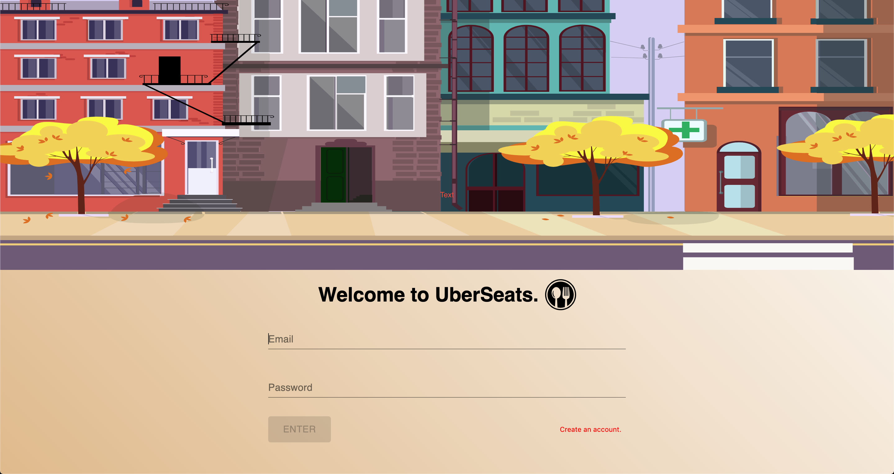

# UberSeats

UberSeats is an an app that helps restaurants to fill up any empty seats, with providing discounts to those who book.
This app also benefits customer who have to book a restaurant last minute. What makes UberSeats convenient is the ability
to cancel any bookings or tables for both the customer and the restaurant, within the given expire time frame. Restaurant owner
can also easily update its restaurant profile, if in the future the owner want to swift towards a different style of cuisine.

# Technologies Used

- React
- React-Router
- Gravatar
- Meteor
- Mongo Database
- Google Map API
- Material-Ui
- Final-Form

# Creators

Oli Wright
GitHub: https://github.com/oliwright1994

Vera Sun
GitHub: https://github.com/verasunyy

Vincent Wang
GitHub: https://github.com/a36168120
